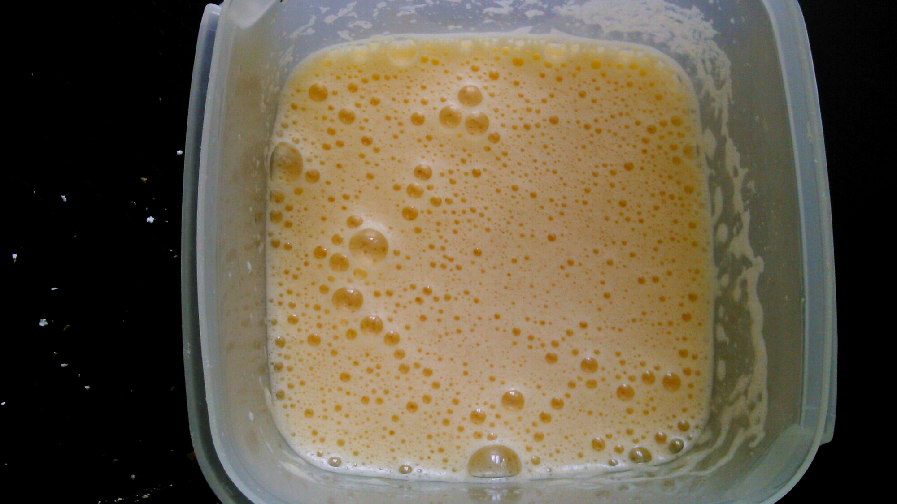
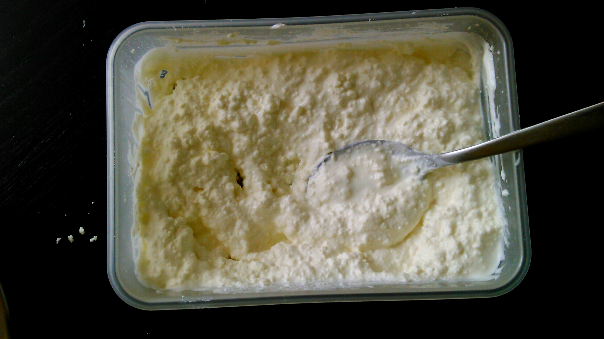
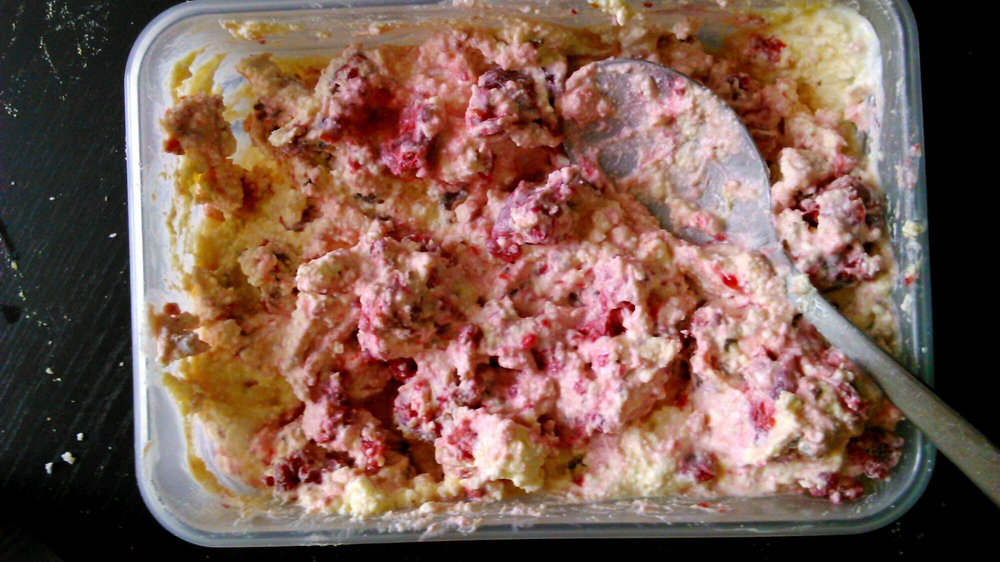
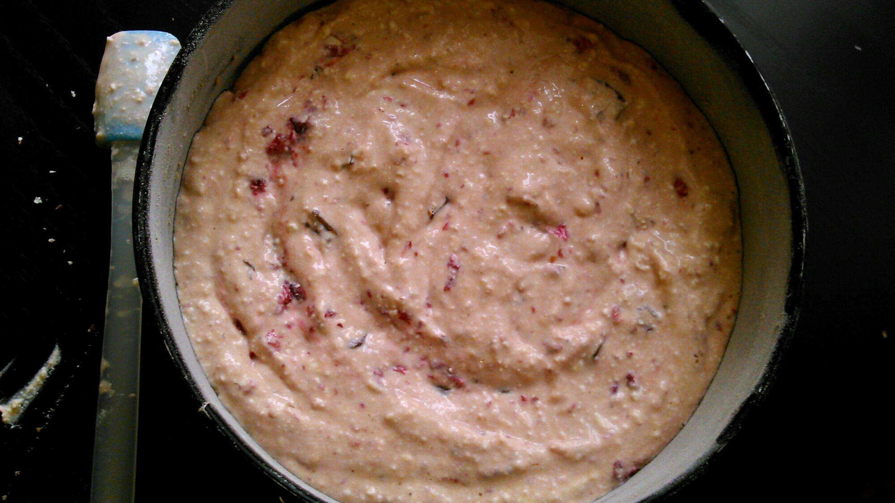
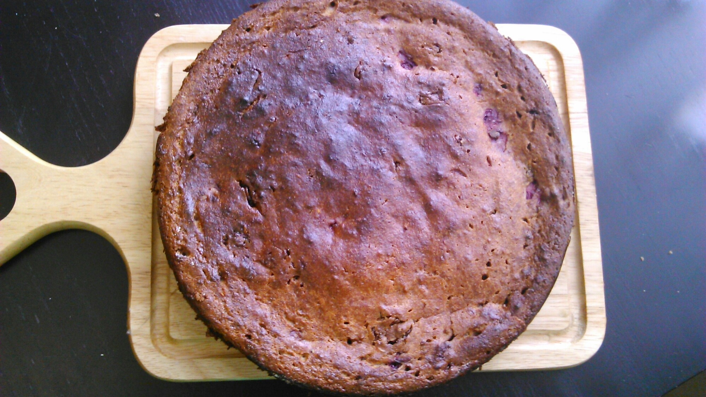

Творог незаменимый продукт в рационе детей. Поэтому я часто готовлю блюда с ним. А если детки не любят его есть в свежем виде или просто сегодня отказываются, тогда надо импровизировать, фантазировать, да что угодно, чтобы в конечном счете получился полезный и вкусный продукт. Так, сегодня выдался тот день когда детки есть в свежем виде не хотят. В морозильной камере была малина, а в холодильнике конечно же есть плитка молочного шоколада. Малина и шоколад им каждый будет рад! Ингредиенты: 
1. Яйца 2 шт.
1. Сахар 3 ст. ложки.
1. Творог 190 грамм.
1. Сметана 150 грамм.
1. Кукурузная мука 50 грамм.
1. Малина 115 грамм.
1. Шоколад молочный с воздушным рисом (можно без риса или белый) 50 грамм.

 Включаем духовой шкаф на шкале 180 градусов. Смазываем форму маслом и посыпаем мукой (форма для торта круглая, диаметром 21 см.) Взбиваем яйца с сахаром до однородной пышной массы, с белой пенкой.  В отдельной миске смешиваем творог (маложирный, сухой) со сметаной, добавляем кукурузную муку, получаем массу по типу манной каши.  Затем к творожной массе кладем малину, ломаем шоколад и все смешиваем.  Полученную массу добавляем к яйцам. Аккуратно смешиваем и выкладываем в форму.  Кладем в духовой шкаф на 45-50 минут.  Примечание: форму из выключенной духовки не вынимать до остывания. Подавать можно с чем любите! Нам по душе натуральный йогурт со сгушенкой! Всем приятного аппетита! 
