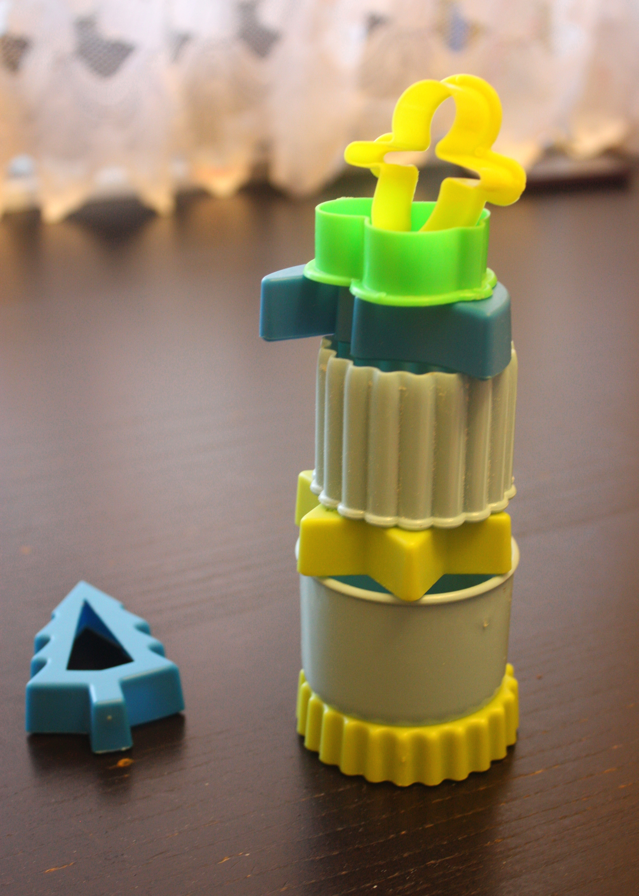

 
Чего-то давненько я не пекла печенье с девочками. Был серый дождливый день, что нередко случается в Петербурге и мы решили испечь наши любимые, обычные печенюшки. Как обычно использовали формочки от Икея.
 
Девочкам нравится помогать: замешивать ингредиенты, фигурки вырезать, посыпать сахаром или просто лепить "колбаску". В общем, занятие проходит в режиме "приятное с полезным"!
 
Так как в этом печенье нет абсолютно ничего лишнего (типа шоколада или вкусовых добавок), то печенье подойдет даже самым маленьким крохам!
 
Начнем!
 
Вам понадобится:
 
1. Творог (не зерновой) - 160 грамм (обычная пачка).
1. Сливочное масло (холодное) - 100 грамм.
1. Яйцо - 2 шт.
1. Мука пшеничная - 400 грамм.
1. Сахар - 70 грамм и немного на посыпку.

 Разогреваем духовку до 200 градусов. Смешиваем яйца с творогом и сахаром. Можно просто вилкой. Перетираем сливочное масло через крупную терку, добавляем к массе. Затем добавляем муку через сито. Всю массу замешиваем ритмично и перекладываем на рабочий стол. Получаем приятный, шелковистый колобочек. Желательно его убрать в холод минут на 30. Но можно и без этого. Раскатываем тесто в пласт около 0,5 мм. Вырезаем формочками детали. Посыпаем сверху сахаром. Кладем на пекарскую бумагу (это для максимального комфорта :-) и выпекаем в разогретой духовке минут 15. Элементарно и вкусно!!! Приятного аппетита!  
