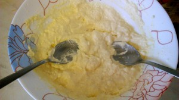
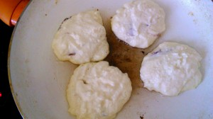

Творожный десерт всем по вкусу и детям и взрослым. А если он еще с любимой начинкой, так вообще не оттащить от тарелки.
 

 
В данном рецепте есть все, что осталось в холодильнике от завтрака.
 
Вам понадобится:
 
1. Творог любой жирности 300 грамм.
1. Манная каша 200 грамм.
1. Яйца 2 штуки.
1. Сахар 3 ст. л.
1. Соль - щепотка.
1. Картофельный крахмал 3 ст. л.
1. Мука 100-150 грамм.
1. Малиновое варенье и изюм.
1. Растительное масло.

 
Все очень просто. Ингредиенты (кроме муки) смешать до состояния однородной каши. Лучше использовать венчик.
 
В конце добавить муку, добиваясь состояния густой сметаны.
 
Параллельно ставим сковороду на средний газ, наливая немного растительного масла.
 
А дальше немного сложнее.
 
Одной столовой ложкой черпаем творожную массу, делаем небольшое углубление. Кладем в него пол чайной ложки варенья или несколько изюминок и второй столовой ложкой собираем массу с краев к центру, пытаясь спрятать начинку.
 

 
Послушайте, ничего страшного нет, если начинка вытекла или смешалась. Все равно получится волшебно!
 
Кладем массу на разогретую сковороду и поджариваем с каждой стороны по минутке.
 

 
Есть несколько способов облегчить себе работу.
 
Добавить больше муки, чтобы оладьи слепить руками или исключить жидкую начинку.
 
Но вкус будет уже не тот.
 
P.S. Про картофельный крахмал я упомянула неспроста. Благодаря нему оладьи получаются воздушнее и пышнее. О таком подходе к приготовлению оладьев я узнала из кулинарного журнала Джейми Оливера.
 
Завариваем свой любимый чай.
 
И принимаемся за трапезу.
 

 

 
Приятного аппетита!
 

