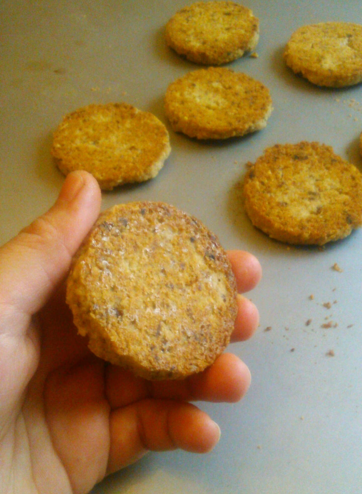

 Cookies with oatmeal and lemon. Ох забуду, а может потеряю, а может что еще... Делали вчера с девочками к чаю печенья, так чтоб быстренько, да вкусненько! Оставались овсяные хлопья совсем чуть, вот и вышло немного, штук 15-16 :-) В измельчителе овсянку прокрутила (100 грамм), затем туда же кинула сахар 1 ст.ложку, изюм темный горсть, и грецкие орехи тоже немного (штук 5-6), также прокрутила. Отдельно сливочного масла комнатной температуры (грамм 50-60). Все соединила и получила кашицу. А скучно еще как-то........а не добавить ли нам оставшийся лимон с соком, да прямо так и возьмем, да и прокрутим в измельчителе! Измельченный лимон (1/3 шт.) прямо с кожурой и соком отправился в путешествие в овсяную страну. Все вместе подружились, пообщались, к ним прибежала еще щепотка соли и стало ну совсем все здорово! Затем, для порядку вся дружная кампания отправилась охладиться, минут так на 15. После этого можно разойтись в разные стороны и принять нужный облик и снова принять охлаждающий душ (минут так на 5-10). Ну, пора! Пора! История наша на этом заканчивается, а может только начинается после 8-10 минутного пребывания в печи (при 165 градусах). Приятного овсянопечения! :-)
