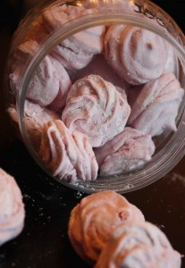
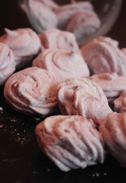
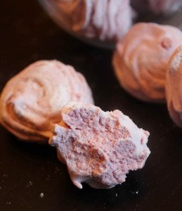
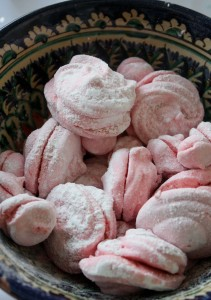

   
 
Зефир! Скажите кто его не любит?
 
Это воздушное, мягкое лакомство по душе каждому.
 
Он может быть сладким или менее сладким, крупной формы или небольшой, с добавлением пюре из разных ягод и фруктов.
 
В общем, фантазируйте на славу!
 
В составе только натуральные ингредиенты (яблочное пюре, сахар, агар-агар, яичный белок).
 
На фотографии выше представлен розовый зефир с небольшим количеством пюре из черной смородины.
 

 
На этой фотографии малиновый зефир, с малиновым пюре.
 
Стоимость индивидуальная. От 150 руб. за 500 грамм зефира.
 
Страница для заявок [Главная.](../shop)

